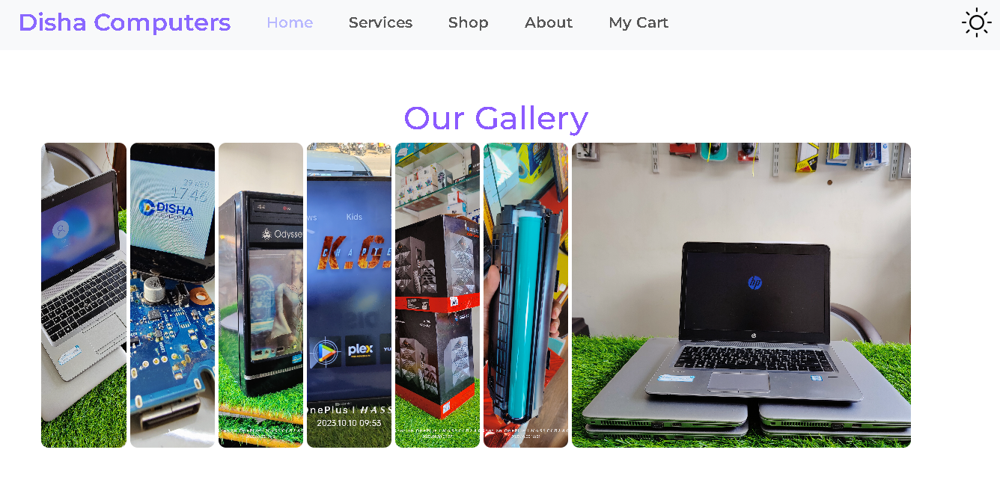

# Disha Computers
Welcome to the **Disha Computers** website project! This repository contains the source code for a website dedicated to selling and repairing laptops and computers. The project is built using HTML, CSS, and JavaScript.

# Project Overview
Disha Computers is a website designed to provide customers with information about the products and services offered by our computer shop. The website features an intuitive user interface, comprehensive product listings, and detailed service descriptions to ensure an excellent user experience.

# Technologies Used
**HTML:** For creating the structure and content of the web pages.
**CSS:**For styling the website and ensuring a visually appealing design.
**JavaScript:** For adding interactivity and enhancing the user experience.
**Responsive Design:** The website is fully responsive and optimized for viewing on different devices, ensuring a seamless experience on desktops, tablets, and smartphones.

### How it works:
navigate to the diferent pages through both header and footer

# Pages Include:
### 1.Home

An engaging landing page that introduces visitors to Disha Computers and highlights our key services.

### 2.Services

Information about various repair and maintenance services offered, including pricing and service details.
### 3.Shop
### 4.About
A simple and effective contact form allowing customers to get in touch with us for inquiries or support.

### 5.My Cart
